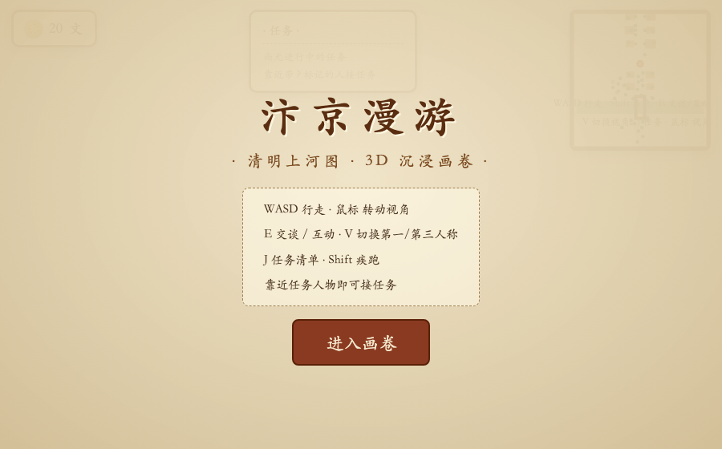
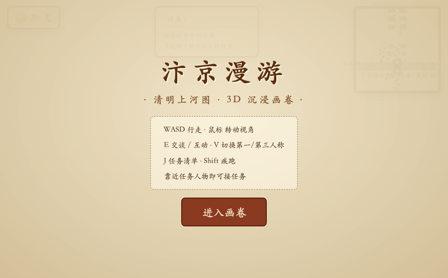
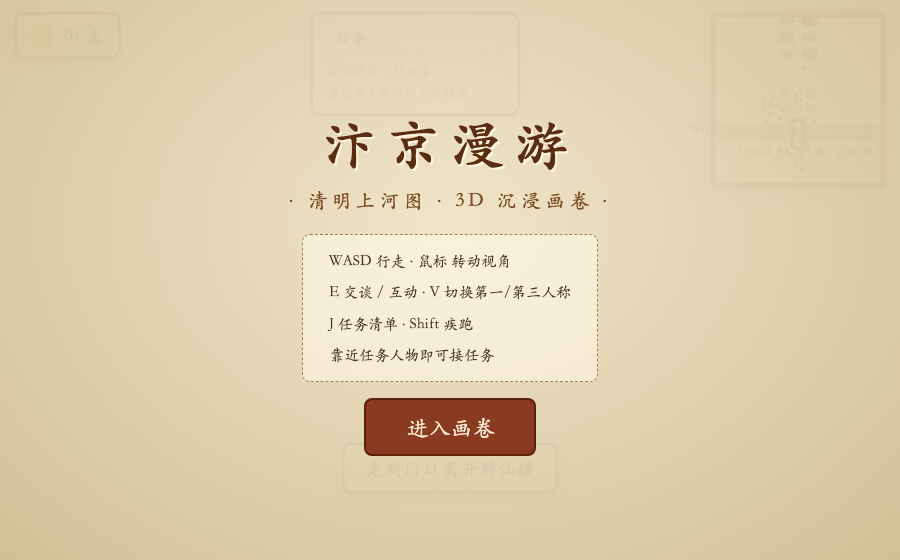
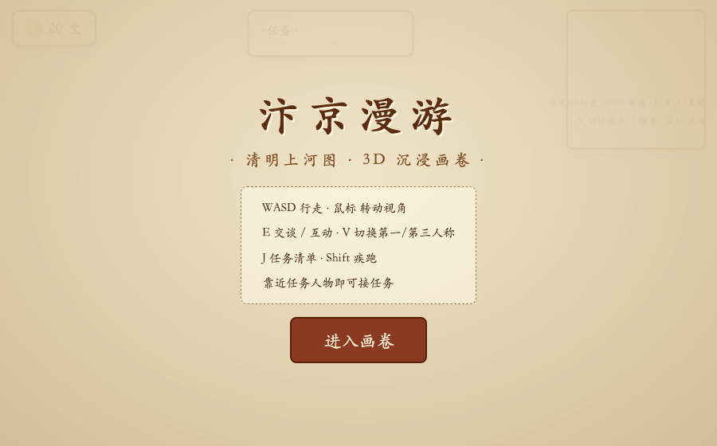

# 汴京漫游 · 3D《清明上河图》沉浸画卷

以北宋《清明上河图》为蓝本的程序化 3D 沉浸式漫游游戏。街道、店铺、虹桥、汴河、集市与 50 余位宋代人物全部由代码实时生成，**零外部资源、零网络请求**，构建产物可直接部署到 GitHub Pages，浏览器打开即玩。

## 🌐 在线体验

> **👉 https://juicyzhou.github.io/qingming-shanghe-tu-3d/**

桌面端：`WASD` 行走 · 鼠标转向 · `E` 交谈 · `V` 切换视角
移动端：左侧摇杆移动 · 右侧拖动看视角 · 圆形按钮交谈

| | |
|:---:|:---:|
|  |  |
| **主街店铺与行人** | **虹桥 · 汴河 · 货船** |
|  |  |
| **可进入的店铺内室** | **开场标题** |

## 🎮 玩法

- **行走探索**：`WASD` 移动 · `Shift` 疾跑 · 鼠标转动视角
- **双视角**：`V` 在第一人称 / 第三人称间切换
- **交谈互动**：靠近人物或物品，按 `E` 交谈 / 采集
- **任务系统**：8 条任务线（送干粮、买茶叶、寻说书人、采药草、节奏撑船、城门传话、码头送布、糖人招客）
- **结算成长**：完成任务获铜钱与声望，`J` 查看画卷成就
- **小地图**：右上角实时显示城镇与人物位置
- **古风音效**：Web Audio 实时合成五声拨弦 BGM 与交互音效

### 📱 移动端触控

- **左虚拟摇杆**：移动（跟随视角方向）
- **右侧拖动**：转动视角
- **圆形按钮**：`交谈`（互动）、`视角`（双视角切换）、`任务`（成就）
- 撑船小玩法自动出现「推桨」按钮
- 触屏设备自动降渲染档位（像素比 1、关闭描边）以保证流畅

## ✨ 画面风格

- 国画手绘风：米色纸感、暖色 toon 光影、墨线描边、雾霭层次
- 标志性元素：虹桥、汴河货船、沿街店铺幌子、城门、集市、垂柳
- 40+ 位形态各异的宋代人物（货郎 / 茶博士 / 书生 / 僧人 / 船夫 / 衙役 / 孩童…），头顶名牌与任务标记

## 🚀 本地运行

```bash
npm install
npm run dev      # 开发（自动打开浏览器）
npm run build    # 生产构建 → dist/
npm run preview  # 本地预览构建产物
```

## ☁️ 部署到 GitHub Pages

方式一（推荐，自动）：将代码推送到 GitHub 仓库的 `main` 分支，`.github/workflows/deploy.yml` 会自动构建并发布到 Pages（需在仓库 Settings → Pages 选择 "GitHub Actions" 作为发布源）。

方式二（手动）：`npm run build` 后把 `dist/` 目录整个拖入任意静态托管（GitHub Pages / Netlify / Vercel / 本地 HTTP 服务均可）。

## 🧪 自测

- 任务状态机：`node /tmp/qtest.mjs` 等（详见 src/main.js 中 `?autostart=1&selftest=1` 调试钩子）
- 场景探针：`?autostart=1&simple=1&nonpc=1` 可输出场景关键坐标颜色报告

## 📁 结构

```
src/
├── core/     Game 主循环、输入、程序化音频
├── render/   国画材质库（Canvas 贴图）、后处理、水面着色器
├── world/    地形/汴河/虹桥/店铺/集市/城门/装饰 + 布局碰撞
├── chars/    Character 木偶角色、外观生成器、玩家、NPC
├── game/     对话/任务/背包/HUD/结算
└── data/     NPC 名单、任务定义、对话脚本
```

## ⚠️ 说明

- 所有模型与贴图均为程序化生成，首次加载需数秒生成 2200+ 网格。
- 建议桌面 Chrome / Edge / Firefox 体验；移动端可打开但建议横屏。
